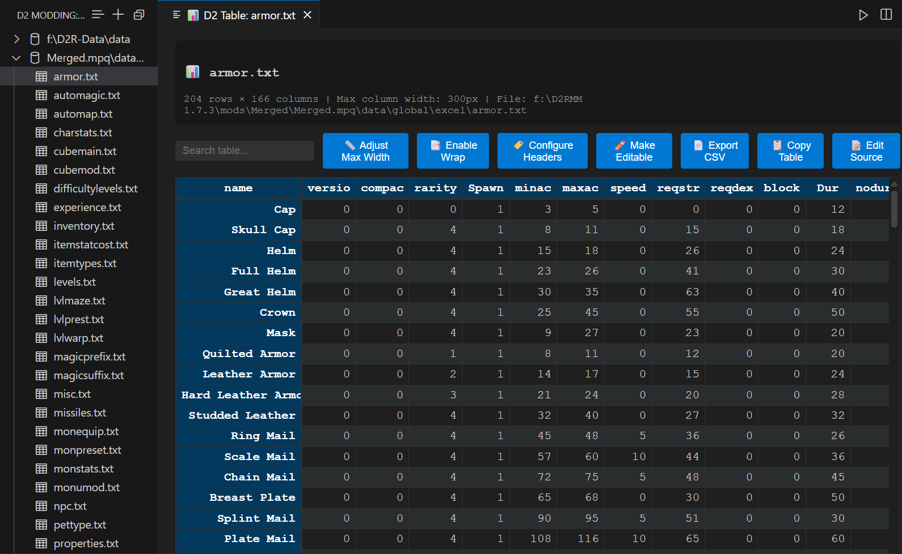

# D2 Modder's Comparator

A comprehensive Visual Studio Code extension for Diablo 2 modders to compare, edit, and manage TXT data files. This extension is inspired by the D2Compare tool and reimagined as a native VSCode plugin to empower Diablo 2 modders with powerful tools for editing and comparing tab-delimited .TXT data files.

## Features

### 🗂️ Dataset Management
- **Sidebar Tree View**: Organize and manage multiple D2 datasets (Legacy D2, D2R, custom mods)
- **Auto-Detection**: Automatically detects D2 game installations and data files
- **Quick Setup**: Easy import of vanilla D2 datasets for comparison with mod files

### 🔍 File Comparison
- **Side-by-Side Diff**: Leverage VSCode's built-in diff editor for file comparisons
- **Multi-File Diffs**: Compare entire directories with summary reports
- **Intelligent Highlighting**: Color-coded differences at row, column, and cell level
- **Filter Options**: Ignore whitespace, comments, or specific columns

### 📊 Table Viewer
- **Spreadsheet Interface**: View and edit TXT files in an intuitive table format
- **Custom Headers**: Configurable column headers with smart abbreviations for D2 data files
- **Dynamic Columns**: Adjustable column widths with tight-fitting options
- **Text Wrapping**: Optional text wrapping for long content
- **Real-time Editing**: Edit cells directly with immediate validation

### ✏️ Advanced Editing
- **Syntax Highlighting**: Custom syntax highlighting for D2 TXT files
- **Auto-Completion**: Smart suggestions based on D2 Data Guide
- **Validation**: Real-time validation with error highlighting and tooltips
- **Cross-File Consistency**: Detect references to non-existent entries

### 🔧 Modding Tools

#### Search and Query
- **Global Search**: Search across all datasets with regex support
- **Smart Filters**: Filter by file type, column, or value ranges
- **Context-Aware Results**: See surrounding context for each match

#### Format Conversion
- **Legacy ↔ D2R**: Convert between Legacy D2 and D2R formats
- **Auto-Detection**: Automatically detect source format
- **Safe Conversion**: Preview changes before applying
- **Column Mapping**: Smart handling of added/removed columns

#### Validation Engine
- **Schema-Based**: Validate against known D2 file structures
- **Type Checking**: Ensure numeric fields contain valid numbers
- **Range Validation**: Check for reasonable value ranges
- **Cross-Reference**: Validate skill/item/monster references

## Screenshots

### Table Viewer - Dark Theme



The D2 Table Viewer provides an intuitive spreadsheet-like interface for viewing and editing D2 .txt files, with support for custom headers, column width adjustment, and automatic data validation.

## Getting Started

### Installation
1. Install the extension from the VS Code Marketplace
2. Open a folder containing D2 TXT files
3. The extension will automatically enable D2 Modding features (configurable)

### Quick Start
1. **D2 Modding Features**: Enabled by default - use `Ctrl+Shift+P` → "Toggle D2 Modding" to disable/enable
2. **Add Dataset**: Click the "+" button in the D2 Datasets panel
3. **Compare Files**: Right-click any .txt file → "Compare TXT Files"
4. **Validate Files**: Right-click any .txt file → "Validate TXT File"

## Commands

- `D2 Modding: Toggle D2 Modding` - Toggle D2 modding features on/off
- `D2 Modding: Add Dataset` - Add a new dataset folder
- `D2 Modding: Select Comparison Dataset` - Choose a dataset for file comparisons
- `D2 Modding: Compare Files` - Compare selected file with another
- `D2 Modding: Open Comparator` - Open the comparison webview
- `D2 Modding: Search Across Datasets` - Global search functionality
- `D2 Modding: Validate TXT File` - Validate current or selected file
- `D2 Modding: Convert Format` - Convert between Legacy and D2R formats
- `D2 Modding: Open Table Viewer` - Open TXT file in spreadsheet-like table viewer
- `D2 Modding: Convert TSV to Space-Aligned` - Convert tab-separated to space-aligned format
- `D2 Modding: Convert Space-Aligned to TSV` - Convert space-aligned to tab-separated format
- `D2 Modding: Preview Space Alignment` - Preview space-aligned format without saving

## Configuration

```json
{
    "d2Modding.autoEnable": true,
    "d2Modding.defaultDatasetPath": "C:\\Games\\Diablo II\\data",
    "d2Modding.autoDetectGameInstalls": true,
    "d2Modding.diffSensitivity": "moderate",
    "d2Modding.validateOnSave": true,
    "d2Modding.tableViewer.maxColumnWidth": 200,
    "d2Modding.tableViewer.wrapText": false,
    "d2Modding.tableViewer.useCustomHeaders": true,
    "d2Modding.tableViewer.customHeaders": {
        "CharsiMagicMin": "CharM↓",
        "LysanderMagicMax": "LysM↑",
        "srvstopfunc": "SrvStop",
        "durability": "Dur"
    }
}
```

### Configuration Options

- **`d2Modding.autoEnable`** (default: `true`): Automatically enable D2 modding features when the extension loads. Set to `false` to require manual activation via the "Toggle D2 Modding" command.
- **`d2Modding.defaultDatasetPath`**: Default path to D2 game data files
- **`d2Modding.autoDetectGameInstalls`**: Automatically detect D2 and D2R game installations  
- **`d2Modding.diffSensitivity`**: Sensitivity level for file comparisons (strict/moderate/relaxed)
- **`d2Modding.validateOnSave`**: Validate TXT files when saved
- **`d2Modding.tableViewer.maxColumnWidth`** (default: `200`): Maximum width in pixels for table columns (50-500px range)
- **`d2Modding.tableViewer.wrapText`** (default: `false`): Wrap text in table columns when content exceeds maximum column width
- **`d2Modding.tableViewer.customHeaders`** (default: `{}`): Custom header mappings for D2 table files. Map original header names to preferred display names (e.g., `{"CharsiMagicMin": "CharM↓", "durability": "Dur"}`)

## Supported Files

The extension recognizes and provides enhanced support for common D2 data files:

- **Core Files**: Armor.txt, Weapons.txt, Misc.txt
- **Character**: Skills.txt, CharStats.txt, Experience.txt
- **Monsters**: MonStats.txt, MonStats2.txt, MonType.txt
- **Levels**: Levels.txt, LvlMaze.txt, LvlSub.txt
- **Magic**: MagicPrefix.txt, MagicSuffix.txt, Gems.txt
- **And many more...**

## Extension Architecture

```
src/
├── extension.ts              # Main extension entry point
├── providers/
│   └── datasetTreeProvider.ts # Dataset tree view management
├── viewers/
│   └── tableViewer.ts        # Table viewer with spreadsheet interface
├── webviews/
│   └── comparatorWebview.ts  # File comparison interface
├── editors/
│   └── d2TextEditor.ts       # Custom text editor for D2 files
└── utils/
    ├── fileValidator.ts      # TXT file validation
    ├── formatConverter.ts    # TSV/Space-aligned conversion
    ├── searchProvider.ts     # Global search functionality
    └── textFormatter.ts      # Text formatting utilities
```

## Development

### Prerequisites

- Node.js 18+
- VS Code 1.90.0+
- TypeScript 5.0+

### Building

```bash
npm install
npm run compile     # Compile TypeScript
npm run watch      # Watch for changes
npm run package    # Create VSIX package
```

### Testing
```bash
npm run test       # Run unit tests
npm run test-watch # Watch mode testing
```

### Debugging
1. Open the project in VS Code
2. Press `F5` to launch the Extension Development Host
3. Test the extension in the new VS Code window

## Contributing

We welcome contributions! Please see our [Contributing Guide](CONTRIBUTING.md) for details.

### Areas for Contribution
- Additional file schemas and validation rules
- Support for more D2 file types
- Enhanced format conversion mappings
- Performance optimizations
- UI/UX improvements

## Roadmap

### Near Term (v1.0)
- [x] Basic dataset management
- [x] File comparison and validation
- [x] Table Viewer with custom headers and column width adjustment
- [x] Format conversion (TSV ↔ Space-aligned)
- [x] Global search functionality
- [x] Auto-refresh on configuration changes
- [ ] Enhanced schema validation
- [ ] Export functionality

### Future Versions
- [ ] Integration with CascView/MPQ Editor
- [ ] Community schema sharing
- [ ] Advanced merge tools
- [ ] Mod dependency tracking
- [ ] Visual diff enhancements
- [ ] Legacy ↔ D2R format conversion

## Known Issues

- Large datasets (1000+ files) may impact performance
- Some D2R exclusive columns may not have complete validation schemas
- Format conversion is currently basic and may need manual review

## Support

- **Documentation**: [D2R Data Guide](https://d2mods.info/home/viewtopic.php?f=8&t=65492)
- **Issues**: [GitHub Issues](https://github.com/your-repo/issues)
- **Community**: [D2 Modding Discord](https://discord.gg/d2modding)

## License

This project is licensed under the MIT License - see the [LICENSE](LICENSE) file for details.

## Acknowledgments

- Inspired by the original D2Compare tool
- Thanks to the D2 modding community for feedback and testing
- Built on the excellent VS Code extension API
